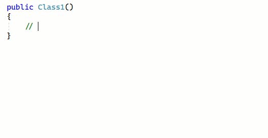

[marketplace]: https://marketplace.visualstudio.com/items?itemName=MadsKristensen.EmojiSense
[vsixgallery]: http://vsixgallery.com/extension/EmojiSense.2461fd3c-53c0-4e86-a00f-52d181d4a194/
[repo]:https://github.com/madskristensen/EmojiSense

# EmojiSense for Visual Studio

Download this extension from the [Visual Studio Marketplace][marketplace]
or get the [CI build][vsixgallery].

--------------------------------------

Gives IntelliSense for emojis inside strings and comments in the Visual Studio editor. Just type a colon to show the list of available emojis

Inspired by [:emojisense:](https://marketplace.visualstudio.com/items?itemName=bierner.emojisense) for VS Code by [Matt Bierner](https://github.com/mattbierner)

## How can I help?
If you enjoy using the extension, please give it a ★★★★★ rating on the [Visual Studio Marketplace][marketplace].

Should you encounter bugs or if you have feature requests, head on over to the [GitHub repo][repo] to open an issue if one doesn't already exist.

Pull requests are also very welcome, since I can't always get around to fixing all bugs myself. This is a personal passion project, so my time is limited.

Another way to help out is to [sponsor me on GitHub](https://github.com/sponsors/madskristensen).
